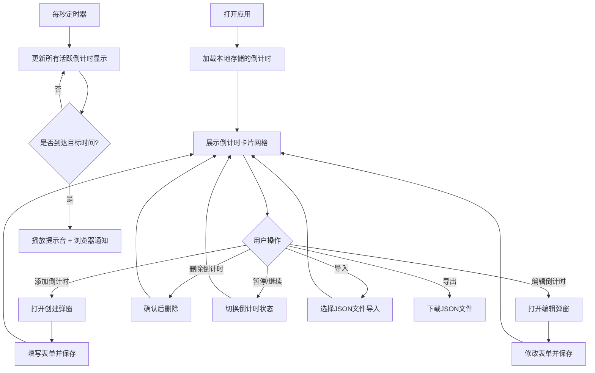

## 1. 产品概述

倒计时闹钟集合是一款基于浏览器的时间管理工具，支持同时管理多个倒计时/正计时事件。用户可以为每个事件自定义名称、目标时间和背景颜色，以精美的卡片形式直观展示剩余时间或已过时间。

- 核心用途：管理生日、会议、节日、项目截止日期等重要时间节点
- 目标用户：需要追踪多个时间节点的个人用户和团队
- 产品价值：将分散的时间提醒集中化、可视化、可定制化

## 2. 核心功能

### 2.1 用户角色
| 角色 | 注册方式 | 核心权限 |
|------|----------|----------|
| 普通用户 | 无需注册，本地存储 | 创建、编辑、删除、暂停倒计时；导入导出数据 |

### 2.2 功能模块
1. **主页（倒计时看板）**：顶部工具栏、倒计时卡片网格、空状态提示
2. **创建/编辑倒计时**：名称输入、目标时间选择、背景颜色选择、倒计时/正计时模式切换
3. **倒计时卡片**：实时刷新显示、暂停/继续、编辑、删除、完成状态提示

### 2.3 页面详情
| 页面名称 | 模块名称 | 功能描述 |
|----------|----------|----------|
| 主页 | 顶部工具栏 | 添加倒计时按钮、批量导入/导出按钮、主题切换 |
| 主页 | 卡片网格 | 响应式卡片布局，展示所有倒计时事件 |
| 主页 | 倒计时卡片 | 显示名称、剩余/已过时间（天时分秒）、进度指示、操作按钮 |
| 创建/编辑弹窗 | 表单 | 名称、目标时间、背景颜色、模式选择，支持创建和保存 |

## 3. 核心流程

用户打开应用后，主页展示已有倒计时卡片。用户可以点击"添加"按钮创建新倒计时，填写名称、目标时间、背景颜色并选择模式后保存。倒计时每秒自动刷新，暂停时停止计时。时间到达时播放提示音并发送浏览器通知。用户可通过JSON文件导入/导出所有倒计时数据。

## 4. 用户界面设计

### 4.1 设计风格
- **主色调**：采用深色主题搭配渐变霓虹色卡片背景，营造现代感和科技感
- **辅助色**：提供8种预设渐变背景色供用户选择
- **按钮风格**：圆角胶囊形按钮，半透明玻璃态效果
- **字体**：使用 Space Grotesk 作为标题字体，搭配 JetBrains Mono 等宽数字字体展示时间
- **布局风格**：响应式网格卡片布局，顶部固定工具栏
- **图标风格**：使用 lucide-react 线性图标

### 4.2 页面设计概览
| 页面名称 | 模块名称 | UI元素 |
|----------|----------|--------|
| 主页 | 顶部工具栏 | 毛玻璃背景、应用标题、功能按钮组、悬浮阴影 |
| 主页 | 卡片网格 | 响应式 1/2/3/4 列布局、卡片间距、滚动容器 |
| 主页 | 倒计时卡片 | 渐变背景、圆角、发光阴影、大号时间数字、名称标签、操作按钮悬停效果 |
| 创建/编辑弹窗 | 表单 | 模态框、表单输入、颜色选择器、时间选择器、模式切换开关 |

### 4.3 响应式
- 桌面端：4列卡片网格
- 平板端：2-3列卡片网格
- 移动端：单列卡片网格，触摸优化按钮尺寸

### 4.4 动效设计
- 页面加载：卡片依次渐入动画（staggered reveal）
- 数字变化：时间数字跳动微动画
- 卡片悬停：轻微上浮 + 阴影增强
- 倒计时完成：脉冲动画 + 色彩闪烁
