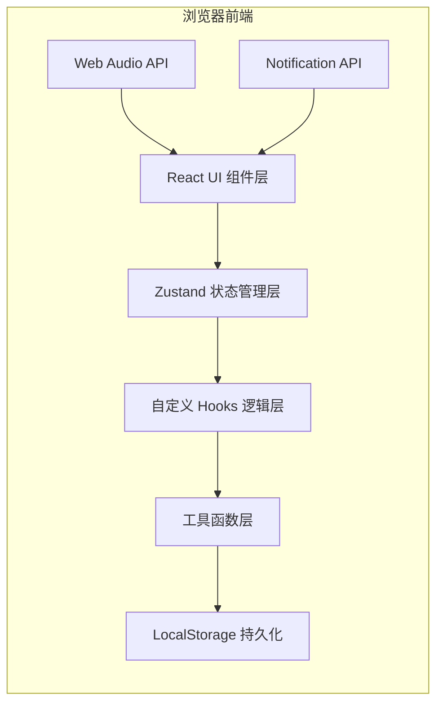
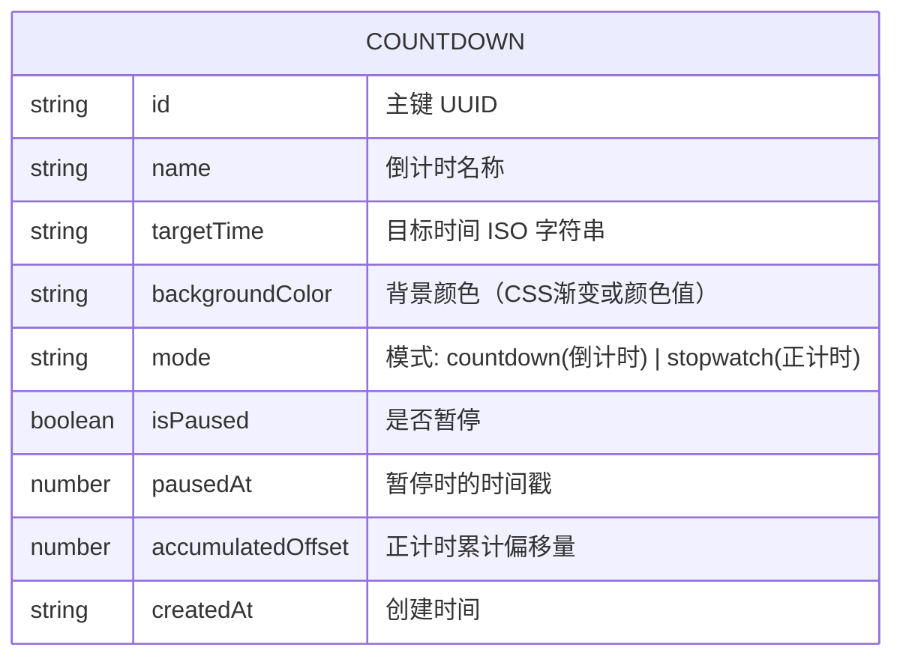

## 1. 架构设计



## 2. 技术描述
- **前端框架**：React 18 + TypeScript
- **构建工具**：Vite
- **样式方案**：Tailwind CSS 3
- **状态管理**：Zustand
- **图标库**：lucide-react
- **数据持久化**：浏览器 LocalStorage
- **音频**：Web Audio API（生成提示音，无需外部音频文件）
- **通知**：浏览器 Notification API

## 3. 路由定义
| 路由 | 用途 |
|------|------|
| / | 主页，展示所有倒计时卡片和操作入口 |

本应用为单页应用，无需多路由。使用模态框实现创建/编辑功能。

## 4. 数据模型

### 4.1 数据模型定义



### 4.2 TypeScript 类型定义

```typescript
type CountdownMode = 'countdown' | 'stopwatch';

interface Countdown {
  id: string;
  name: string;
  targetTime: string;
  backgroundColor: string;
  mode: CountdownMode;
  isPaused: boolean;
  pausedAt: number | null;
  accumulatedOffset: number;
  createdAt: string;
}

interface TimeLeft {
  days: number;
  hours: number;
  minutes: number;
  seconds: number;
  isExpired: boolean;
}
```

## 5. 项目文件结构

```
src/
├── components/
│   ├── CountdownCard.tsx       # 倒计时卡片组件
│   ├── CountdownForm.tsx       # 创建/编辑表单组件
│   ├── CountdownGrid.tsx       # 卡片网格布局组件
│   ├── Header.tsx              # 顶部工具栏
│   ├── Modal.tsx               # 通用模态框组件
│   └── ColorPicker.tsx         # 颜色选择器组件
├── hooks/
│   ├── useCountdownTimer.ts    # 倒计时/正计时计算逻辑
│   ├── useNotification.ts      # 浏览器通知 Hook
│   └── useAudioAlert.ts        # 音频提示 Hook
├── store/
│   └── useCountdownStore.ts    # Zustand 状态管理
├── types/
│   └── countdown.ts            # 类型定义
├── utils/
│   ├── timeUtils.ts            # 时间计算工具函数
│   └── storage.ts              # LocalStorage 封装
├── App.tsx                     # 主应用入口
├── main.tsx                    # React 渲染入口
└── index.css                   # 全局样式
```

## 6. 核心逻辑设计

### 6.1 时间计算逻辑
- 倒计时模式：`剩余时间 = 目标时间 - 当前时间`（暂停时保存快照）
- 正计时模式：`已过时间 = 当前时间 - 起始时间 + 累计偏移`（暂停时累加偏移）
- 每秒刷新：使用单一 `setInterval(1000ms)` 驱动所有倒计时更新

### 6.2 状态管理
- 使用 Zustand 管理所有倒计时列表
- 自动同步到 LocalStorage（debounce 优化）
- 支持通过 JSON 导入/导出整个状态

### 6.3 音频实现
- 使用 Web Audio API 的 `OscillatorNode` 生成提示音
- 倒计时结束时播放 880Hz 音调，持续 0.5 秒，重复 3 次

### 6.4 通知实现
- 使用浏览器 Notification API
- 首次使用时请求通知权限
- 倒计时结束时发送系统通知
